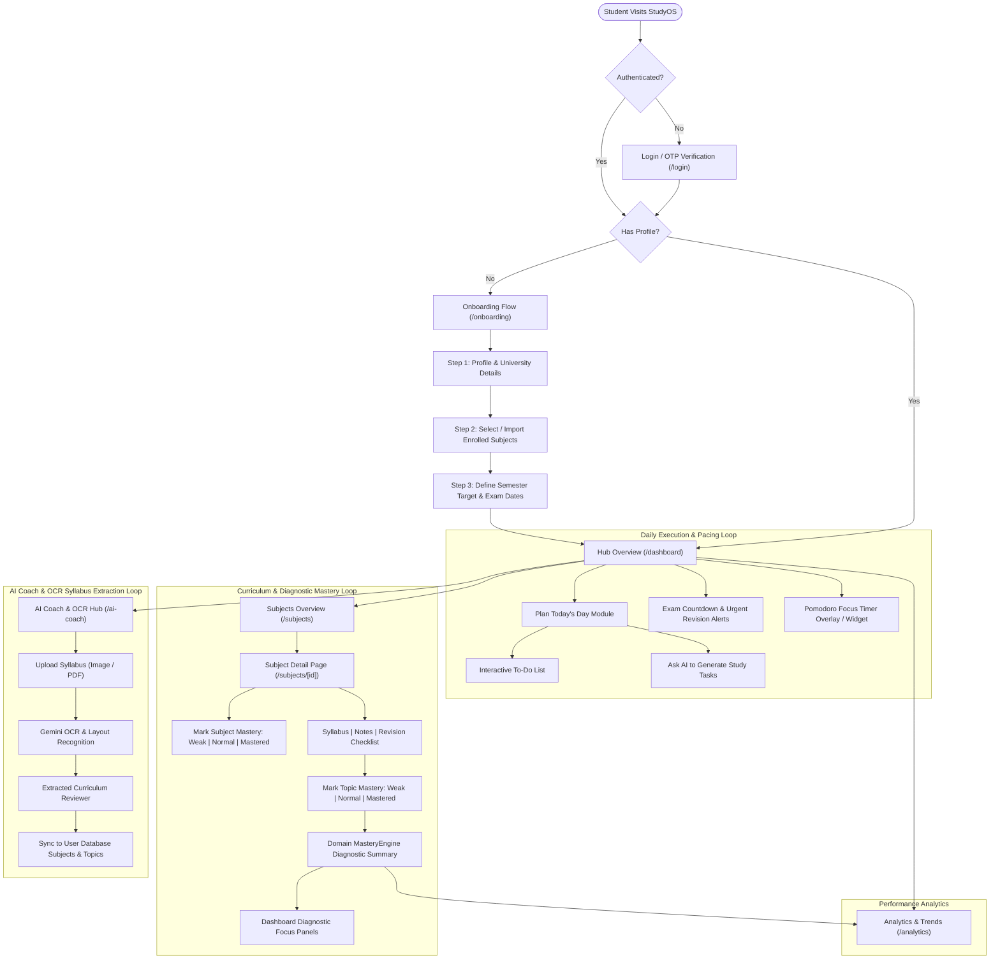
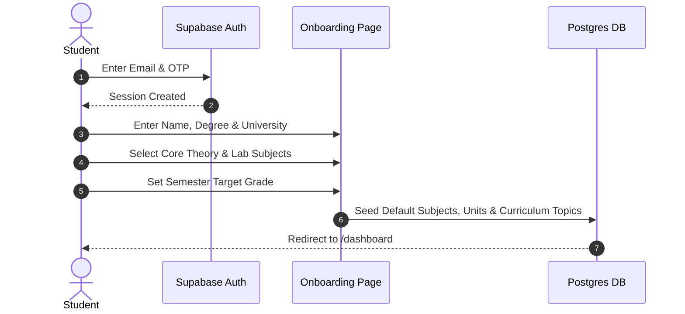
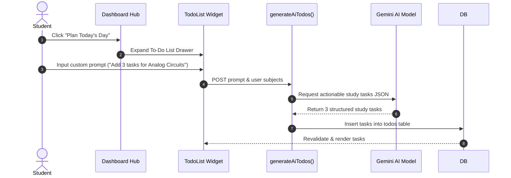
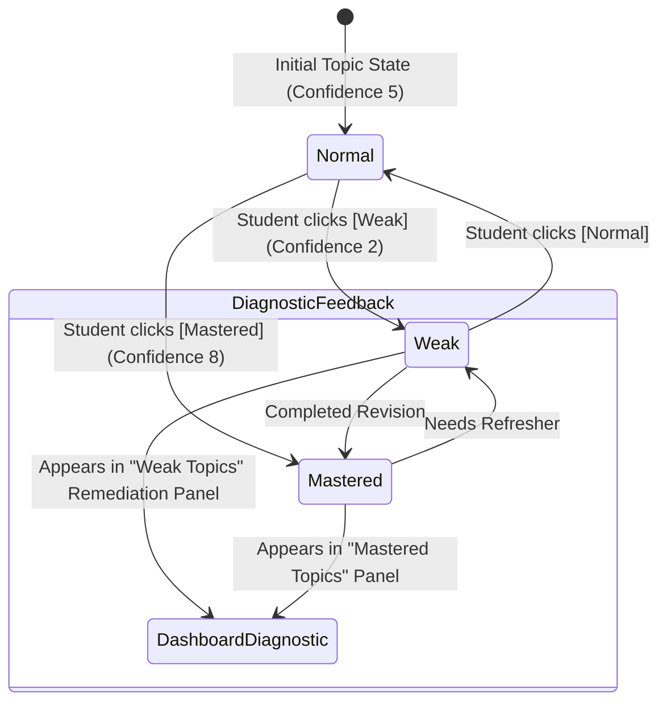

# StudyOS Complete Application Workflow & User Journey

StudyOS is an academic productivity and mastery tracking system designed around three core loops:
1. **Curriculum Intake & Structuring** (Syllabus upload, AI OCR extraction, manual onboarding).
2. **Daily Execution & Pacing** (Plan My Day to-do list, AI study coach, Pomodoro focus timer, Exam countdown).
3. **Diagnostic Mastery Feedback Loop** (Topic-level & Subject-level mastery classification, analytics, weak topic remediation).

---

## Complete End-to-End System Workflow

---

## Detailed Functional Workflows

### 1. User Onboarding & Subject Setup

### 2. Daily Planning & AI Task Generation

### 3. Topic & Subject Mastery Classification Loop

---

## Key Route Map & Action Reference

| Workflow Area | Route Path | Key Components | Primary Server Actions |
| :--- | :--- | :--- | :--- |
| **Authentication** | `app/(auth)/login` | OTP form, Supabase Auth client | `supabase.auth.signInWithOtp()` |
| **Onboarding** | `app/(auth)/onboarding` | Step-by-step setup wizard | `seedInitialData()` |
| **Dashboard Hub** | `app/(dashboard)/dashboard` | `DashboardMasterySummary`, `TodoList`, `ExamCountdownWidget` | `getDashboardData()`, `generateAiTodos()` |
| **Subject Detail** | `app/(dashboard)/subjects/[id]` | `SubjectMasterySelector`, `TopicList` | `updateTopicChecklist()`, `updateTopicMasteryLevel()`, `updateSubjectMasteryLevel()` |
| **AI Coach & OCR** | `app/(dashboard)/ai-coach` | Custom dropzone, Concentric Spinner, Roadmap review | `extractSyllabusFromImage()` |
| **Analytics Hub** | `app/(dashboard)/analytics` | Charts, Study session logs | `getAnalyticsData()` |
